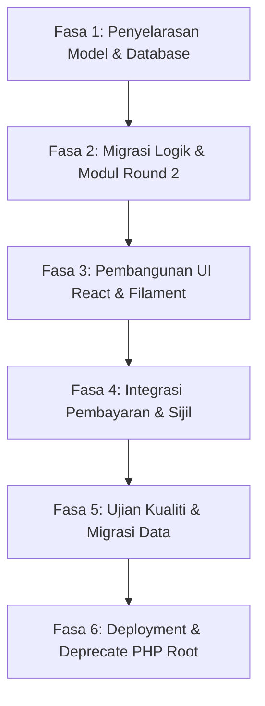

# INOTEK - Rumusan Penuh Sistem Sedia Ada

Semakan terakhir: 16 Jun 2026.

## 1. Gambaran Umum

INOTEK ialah sistem web untuk mengurus pertandingan inovasi dan teknologi UTeM. Sistem ini menyokong kitaran penuh pertandingan bermula daripada pendaftaran akaun, pendaftaran projek, semakan dan kelulusan pentadbir, penugasan juri, pemarkahan pusingan pertama dan kedua, laporan, pembayaran, sijil, tetapan sistem, serta log audit.

Sistem ini dibangunkan sebagai aplikasi PHP tradisional dengan pangkalan data MySQL. Kod semasa menunjukkan gabungan kod moden dan kod legacy: sebahagian modul sudah menggunakan `mysqli`, prepared statements, CSRF token, dan helper berpusat, manakala sebahagian modul lama masih menggunakan fungsi `mysql_*` melalui lapisan keserasian `mysql_shim.php`.

URL produksi yang dinyatakan dalam dokumentasi projek ialah `https://inotek.utem.edu.my`.

## 2. Teknologi Dan Seni Bina

Komponen utama sistem:

| Komponen | Teknologi / Pendekatan |
| --- | --- |
| Backend | PHP 7.4+ gaya procedural |
| Portal baharu | Laravel 13, PHP 8.3, Filament 5, Inertia.js 2, React 18, Tailwind CSS 3, Vite 8 |
| Pangkalan data | MySQL / MariaDB melalui MySQLi |
| Sambungan DB moden | `db_config.php` dan `db_helpers.php` |
| Sokongan legacy DB | `connect.php` dan `mysql_shim.php` |
| Antaramuka | Bootstrap, DataTables, ApexCharts / Chart.js, Iconify, Font Awesome / Flaticon |
| Autentikasi | Session-based login |
| Autentikasi portal | Laravel Breeze / Sanctum, Spatie Permission dan middleware role |
| Keselamatan | CSRF token, session hardening, prepared statements, audit log, security headers |
| Web server | IIS melalui `web.config`, dengan `.htaccess` untuk sokongan Apache |

Fail sambungan pangkalan data utama ialah `db_config.php`. Fail ini mengandungi maklumat host, pengguna, kata laluan, nama pangkalan data dan singleton connection `$connect`. Butiran rahsia tidak disalin dalam dokumen ini atas sebab keselamatan.

## 3. Struktur Projek

Struktur aras utama:

| Lokasi | Fungsi |
| --- | --- |
| `*.php` di root | Modul utama sistem seperti login, dashboard, projek, juri, kelulusan, laporan, tetapan dan sijil |
| `assets/` | CSS, JavaScript, imej, font dan aset frontend |
| `partials/layouts/` | Template layout bersama seperti `layoutTop.php` dan `layoutBottom.php` |
| `project/` | Modul peserta untuk daftar, lihat, kemas kini dan padam projek |
| `judges/` | Portal juri untuk login, dashboard, penilaian dan paparan skor |
| `portal/` | Aplikasi Laravel berasingan untuk portal moden, admin panel Filament, Inertia/React, API route dalaman, migration dan test suite |
| `docs/` | Dokumentasi teknikal, migrasi, keselamatan, testing dan laporan perubahan |
| `logs/` | Log aplikasi seperti error log, audit atau rate limit |
| `backup/` dan `_archive/` | Fail sandaran / arkib lama |
| `images/` | Imej sistem, header, avatar dan bahan visual |

## 4. Peranan Pengguna

Sistem menggunakan medan `tahap` pada jadual `users` untuk menentukan akses:

| Tahap | Peranan | Akses Utama |
| --- | --- | --- |
| `1` | Peserta | Daftar projek, lihat status projek, kemas kini projek jika belum dihantar, lihat maklumat berkaitan penyertaan |
| `2` | Juri | Akses portal juri, lihat projek ditugaskan, isi rubrik penilaian, lihat skor |
| `3` | Pentadbir | Urus pengguna, juri, projek, kelulusan, penugasan juri, laporan, sesi, rubrik, tetapan dan reset data |

`auth_middleware.php` menyediakan fungsi seperti `isLoggedIn()`, `requireAuth()`, `getCurrentUser()`, `getUserRole()`, `hasRole()`, `requireRole()`, `generateCsrfToken()`, `verifyCsrfToken()` dan `sanitizeInput()`.

## 5. Konsep Sesi Pertandingan

Sistem menyokong pelbagai sesi pertandingan melalui jadual `sessions`. Satu sesi boleh ditanda sebagai aktif menggunakan medan `is_active`.

Konsep penting:

- `CURRENT_SESSION_ID` ditentukan dalam `connect.php` berdasarkan sesi aktif.
- Data projek dalam `pendaftaran` diikat kepada `session_id`.
- Data markah dalam `score` diikat kepada `session_id`.
- Tetapan sistem juga menunjukkan bahawa `users` dan `juri` boleh diikat kepada `session_id`.
- `settings.php` menyediakan fungsi pentadbir untuk cipta sesi baharu, aktifkan sesi, dan reset data mengikut sesi.
- `db_migration.php` dan `settings.php` menjalankan migrasi automatik untuk memastikan jadual dan kolum berkaitan sesi wujud.

Sistem menganggap kod projek (`pcode`) unik dalam sesi yang sama, bukan semestinya unik merentas semua sesi.

## 6. Aliran Kerja Utama

### 6.1 Pendaftaran Dan Login

Aliran asas:

1. Pengguna mendaftar atau dicipta oleh pentadbir.
2. Pengguna login melalui `login.php`.
3. Login disahkan terhadap jadual `users`.
4. Kata laluan bcrypt disokong melalui `password_verify()`.
5. Kata laluan legacy plaintext dinaik taraf automatik kepada hash selepas login berjaya.
6. Sesi login disimpan dalam `$_SESSION['login_user']`.
7. Aktiviti login direkodkan ke audit log.

Halaman utama selepas login ialah `main.php`. Jika pengguna ialah juri (`tahap = 2`), sistem mengarahkan pengguna ke `judges/main.php`.

### 6.2 Dashboard

`main.php` memaparkan dashboard berdasarkan peranan:

- Peserta melihat status projek terkini untuk sesi terpilih.
- Admin melihat statistik pengguna, juri, projek, kategori, status projek dan carta.
- Juri dialihkan ke portal juri.

Dashboard menyokong pilihan sesi melalui parameter `session`. Nilai `-1` bermaksud semua sesi.

### 6.3 Pendaftaran Projek Peserta

Modul utama berada di `project/registration.php`, `project/save.php`, `project/view.php`, `project/update.php`, `project/all.php` dan `project/delete.php`.

Aliran pendaftaran projek:

1. Peserta membuka `project/registration.php`.
2. Sistem menyemak sama ada peserta sudah mempunyai projek dalam sesi aktif.
3. Peserta mengisi kategori institusi, kategori projek, ahli pasukan, penyelia, emel, telefon, kod projek, tajuk, abstrak dan pautan poster/video.
4. `project/save.php` menyimpan data ke jadual `pendaftaran`.
5. Status awal projek ialah `1`.
6. `pcode` disemak supaya unik bagi sesi aktif.

Kategori projek semasa:

| Kod | Kategori |
| --- | --- |
| `C1` | Green Technology |
| `C2` | System Engineering |
| `C3` | Emerging Technology |
| `C4` | Human-Interaction Technology |
| `C5` | Integrated Design Project |
| `C6` | Diploma Project |

Kategori peserta:

- `utem` - UTeM
- `ipt` - University / IPT / College

### 6.4 Status Projek

Kod status projek digunakan di beberapa fail seperti `main.php`, `project/all.php`, `round2.php` dan `approve_projects.php`.

| Status | Label Sistem | Maksud Umum |
| --- | --- | --- |
| `1` | New Project | Projek baru direkodkan |
| `2` | Edit Project | Projek dalam mod kemas kini |
| `3` | Submitted | Projek dihantar untuk semakan |
| `4` | Approved | Projek diluluskan pentadbir |
| `5` | Paid / Payment Received | Pembayaran diterima / penyertaan disahkan sepenuhnya |
| `6` | Cancelled | Projek dibatalkan / ditolak |

### 6.5 Kelulusan Pentadbir

`approve_projects.php` membolehkan pentadbir meluluskan projek secara pukal. Fail ini:

- Hanya membenarkan pengguna tahap `3`.
- Memaparkan projek berstatus `3` dalam sesi aktif.
- Menyediakan checkbox untuk pilih projek.
- Mengemas kini status kepada `4` dan menetapkan `tkhLulus`.
- Menggunakan `csrfField()` pada borang.

Fail berkaitan kelulusan lain termasuk `kelulusanAdmin.php`, `approve_projects.php`, `rejectProject.php`, `cancelApproval.php` dan `sahpenyertaan.php`.

### 6.6 Penugasan Juri

Penugasan juri dikendalikan oleh `assign_judge.php` dan `remove_judge.php`.

Ciri penting:

- Hanya admin boleh menugaskan juri.
- Projek disahkan berdasarkan `pcode`, `project_id` dan `session_id`.
- Juri disahkan sebagai pengguna `tahap = 2`.
- Rekod tugasan disimpan dalam jadual `score`.
- Tugasan menyokong `round_no = 1` dan `round_no = 2`.
- Sistem menghalang tugasan pendua untuk projek, juri, pusingan dan sesi yang sama.
- Untuk Round 2, juri yang sudah menilai projek sama dalam Round 1 tidak boleh ditugaskan semula kepada projek tersebut.

### 6.7 Portal Juri Dan Pemarkahan

Portal juri berada dalam folder `judges/`.

Fail penting:

| Fail | Fungsi |
| --- | --- |
| `judges/main.php` | Dashboard juri |
| `judges/evaluate.php` | Senarai / paparan projek untuk dinilai |
| `judges/rubrik_dynamic.php` | Paparan rubrik dinamik |
| `judges/record_dynamic.php` | Simpan markah juri |
| `judges/score.php` | Paparan skor |
| `judges/score_avg.php` | Purata skor |
| `judges/score_full.php` | Laporan skor penuh |

`judges/record_dynamic.php` mengambil rubrik berdasarkan kategori projek melalui jadual `category_rubric_mapping`, kemudian membaca item rubrik daripada `rubric_items`. Markah setiap item biasanya pada skala 0 hingga 5 dan dikira sebagai:

`(markah / 5) * weight`

Jumlah akhir disimpan dalam `score.total`. Butiran item juga boleh disimpan sebagai JSON dalam `score.score_details`. Sistem turut menyimpan komen, tarikh skor, status selesai dan pilihan `best_presenter`.

### 6.8 Rubrik Dinamik

Sistem mempunyai sokongan rubrik dinamik melalui jadual:

- `rubrics`
- `rubric_items`
- `category_rubric_mapping`

`settings.php` menjalankan migrasi dan seed data untuk rubrik awal:

- Standard Rubric untuk beberapa kategori.
- IDP Rubric untuk `C5`.
- Diploma Rubric khusus untuk `C6`.

Pentadbir boleh mengemas kini item rubrik, weight, penerangan dan grading scale. Ini membolehkan kriteria penilaian berubah tanpa perlu menulis semula semua borang penilaian.

### 6.9 Round 2

`round2.php` menyediakan pengurusan pusingan kedua.

Logik utama:

- Sistem mengira purata markah Round 1 (`round_no = 1`) bagi projek yang sudah dinilai.
- Projek dikumpulkan mengikut kategori `C1` hingga `C6`.
- Sistem memilih Top 3 setiap kategori berdasarkan purata markah, menjadikan sasaran maksimum 18 projek.
- Pentadbir boleh melihat shortlist, purata R1, bilangan juri selesai dan bilangan juri ditugaskan.
- Pentadbir boleh menugaskan juri Round 2.
- Juri Round 1 bagi projek yang sama disekat daripada menjadi juri Round 2 untuk projek tersebut.
- Round 2 boleh dikunci atau dibuka semula melalui `lock_r2.php` menggunakan medan `sessions.r2_locked`.
- Laporan perbandingan R1 dan R2 tersedia melalui `round2_report.php`.

Dokumentasi berkaitan Round 2 turut wujud di:

- `2NDJUDGES.md`
- `PELANPUSINGAN2.md`
- `PELANPUSINGAN2_SOP.md`
- `RUNBOOK_PUSINGAN2.md`

### 6.10 Laporan, Skor Dan Sijil

Fail laporan dan paparan keputusan termasuk:

- `reports.php`
- `laporan.php`
- `laporan_new.php`
- `laporan_full.php`
- `round2_report.php`
- `scores.php`
- `sijil.php`

Beberapa fail laporan lama masih merujuk struktur atau nama lama seperti `penyertaan`, manakala modul baharu lebih banyak menggunakan `pendaftaran`. Ini menunjukkan sistem pernah melalui migrasi nama jadual / modul dan masih mengekalkan fail legacy.

### 6.11 Pembayaran

`pembayaran.php` mengurus status berkaitan pembayaran. Status `5` digunakan untuk menunjukkan pembayaran diterima atau penyertaan disahkan sepenuhnya. Dashboard juga mempunyai metrik pendapatan, tetapi dalam `main.php` nilai `total_fees` semasa ditetapkan kepada `0`, menunjukkan modul kewangan mungkin belum lengkap atau dikekalkan sebagai placeholder.

### 6.12 Tetapan Sistem

`settings.php` ialah modul pentadbir yang besar dan penting. Fungsi utama:

- Menjalankan migrasi automatik untuk sesi, rubrik, audit log dan tetapan sistem.
- Mengurus general settings seperti nama acara, tarikh acara, status pendaftaran, status pendaftaran juri, sesi penjurian, paparan keputusan dan maintenance mode.
- Mencipta dan mengaktifkan sesi pertandingan.
- Mengurus rubrik dan mapping kategori.
- Menyediakan reset data per sesi untuk users, judges, projects dan scores.
- Merekod tindakan kritikal ke `audit_logs`.

Reset data mempunyai amaran jelas dan memerlukan teks pengesahan `RESET`. Sesi aktif tidak boleh direset terus.

### 6.13 Portal Laravel Baharu

Folder `portal/` ialah aplikasi Laravel berasingan, bukan sekadar aset sokongan. Ia kelihatan sebagai usaha pemodenan sistem INOTEK di atas pangkalan data legacy yang sama.

Teknologi dan pakej utama portal:

| Komponen | Peranan |
| --- | --- |
| Laravel 13 / PHP 8.3 | Framework backend portal moden |
| Filament 5 | Panel admin dan resource CRUD |
| Inertia.js 2 + React 18 | Antaramuka frontend moden |
| Tailwind CSS 3 + Vite 8 | Styling dan build asset |
| Spatie Permission 7 | Role dan permission |
| Laravel Reverb / Echo / Pusher JS | Sokongan papan pendahulu masa nyata / WebSocket |
| DomPDF | Penjanaan sijil PDF |
| PHPUnit 12 | Ujian automatik |

Route utama dalam `portal/routes/web.php` merangkumi:

- Dashboard berasaskan role.
- Profil pengguna.
- CRUD projek dan ahli pasukan.
- Leaderboard.
- Muat turun sijil.
- Route juri untuk penilaian dan simpan skor.
- Route admin untuk projek, kelulusan, juri, skor, laporan, kategori, pembayaran, pengguna, sesi pertandingan, rubrik, tetapan sistem dan audit log.

Struktur domain portal:

| Lokasi | Fungsi |
| --- | --- |
| `portal/app/Models/` | Model `User`, `Project`, `Score`, `CompetitionSession`, `Rubric`, `RubricItem`, `Category`, `TeamMember`, `AuditLog`, `SystemSetting` |
| `portal/app/Http/Controllers/` | Controller dashboard, projek, skor, juri, laporan, pembayaran, sijil, kategori, sesi, rubrik, pengguna, tetapan dan audit log |
| `portal/app/Filament/Resources/` | Resource admin untuk `User`, `CompetitionSession`, `Rubric`, `SystemSetting` dan `AuditLog` |
| `portal/app/Services/ScoreCalculator.php` | Pengiraan markah berwajaran, purata projek dan leaderboard |
| `portal/app/Observers/` | Audit automatik untuk skor, rubrik dan sesi pertandingan |
| `portal/app/Policies/` | Kawalan akses projek dan skor |
| `portal/database/migrations/` | Migration untuk users, permission, force password reset, constraint skor, kategori, sesi pertandingan dan audit logs |
| `portal/tests/` | Ujian feature dan unit termasuk submission projek, isolasi sesi skor, akses juri, dashboard mode dan autentikasi |

`ScoreCalculator` dalam portal menggunakan rubrik dinamik untuk pengiraan berwajaran. Ia masih mengekalkan keserasian dengan kolum skor legacy seperti `a1`, `a2`, `a3`, `a4`, `a5`, `b1` dan `c1`, manakala item rubrik tambahan disimpan dalam `score_details` JSON.

Portal mempunyai fail `portal/README.md` yang lebih khusus untuk pemasangan, development, testing, CI dan workaround Windows UNC path. Dokumentasi utama ini perlu dianggap sebagai gambaran keseluruhan seluruh sistem, manakala `portal/README.md` ialah rujukan operasi khusus portal Laravel.

## 7. Jadual Pangkalan Data Penting

Berdasarkan fail kod dan migrasi, jadual penting termasuk:

| Jadual | Fungsi |
| --- | --- |
| `users` | Akaun pengguna, peranan, maklumat profil dan `session_id` |
| `juri` | Data juri legacy / tambahan |
| `pendaftaran` | Rekod projek / penyertaan |
| `score` | Tugasan juri dan markah penilaian |
| `sessions` | Sesi pertandingan dan status aktif / lock Round 2 |
| `rubrics` | Definisi rubrik |
| `rubric_items` | Item/kriteria rubrik, weight dan grading scale |
| `category_rubric_mapping` | Mapping kategori projek kepada rubrik |
| `system_settings` | Tetapan acara dan sistem |
| `audit_logs` | Jejak audit tindakan penting |
| `activity_log` | Log aktiviti pengguna |
| `penyelidik` | Data penyelidik bersama legacy |
| `penyertaan` | Jadual legacy yang masih dirujuk oleh sebahagian laporan lama |
| `categories` | Kategori projek dalam portal Laravel |
| `competition_sessions` | Sesi pertandingan versi portal Laravel |
| `model_has_roles`, `role_has_permissions`, `roles`, `permissions` | Jadual Spatie Permission dalam portal Laravel |
| `cache`, `jobs`, `job_batches`, `failed_jobs` | Jadual infrastruktur Laravel untuk cache dan queue |

## 8. Keselamatan

Komponen keselamatan utama:

- `security_config.php` menetapkan session cookie, strict mode, regeneration session ID, session fingerprint, error handling, security headers dan Content Security Policy.
- `auth_middleware.php` menyediakan autentikasi, role guard, CSRF token dan sanitasi input.
- `db_helpers.php` menyediakan wrapper prepared statement untuk operasi database moden.
- `login.php` menggunakan `password_verify()` untuk bcrypt dan menaik taraf password legacy secara automatik.
- `recordAuditLog()` dan `logActivity()` merekod aktiviti penting.
- `web.config` menyekat directory browsing, fail sensitif, PHP dalam folder upload, dan pola query string berisiko.
- `.htaccess` menyediakan sekatan serupa untuk persekitaran Apache.
- `RateLimiter` dalam `security_config.php` menyediakan mekanisme rate limit berasaskan fail JSON.

Perhatian teknikal:

- Beberapa fail masih membina SQL secara string walaupun dengan escaping legacy. Bahagian ini wajar dimigrasi berperingkat kepada `db_helpers.php`.
- Sesetengah fail memanggil `ini_set('display_errors', 1)` walaupun sistem production biasanya perlu menyembunyikan error.
- `settings.php` dan beberapa modul menjalankan migrasi ketika request biasa. Ini memudahkan deployment tetapi boleh memberi risiko prestasi dan kawalan perubahan jika digunakan di production tanpa proses release yang ketat.

## 9. Fail Utama Dan Tanggungjawab

| Fail | Peranan |
| --- | --- |
| `index.php` | Halaman masuk / landing login |
| `login.php` | Proses login |
| `logout.php` | Tamat sesi |
| `main.php` | Dashboard utama |
| `session.php` | Guard login dan pemboleh ubah legacy sesi |
| `connect.php` | Sambungan DB legacy, migration bootstrap dan `CURRENT_SESSION_ID` |
| `db_config.php` | Sambungan MySQLi moden |
| `db_helpers.php` | Helper query, insert, transaction dan audit log |
| `auth_middleware.php` | Middleware autentikasi, role dan CSRF |
| `security_config.php` | Tetapan keselamatan berpusat |
| `mysql_shim.php` | Keserasian fungsi `mysql_*` lama |
| `db_migration.php` | Migrasi automatik struktur penting |
| `projects.php` | Pengurusan projek oleh admin |
| `project/registration.php` | Borang daftar projek peserta |
| `project/save.php` | Simpan projek peserta |
| `project/view.php` | Lihat projek |
| `project/update.php` | Kemas kini projek |
| `approve_projects.php` | Kelulusan projek secara pukal |
| `assign_judge.php` | Tugasan juri kepada projek |
| `remove_judge.php` | Buang tugasan juri |
| `round2.php` | Shortlist dan tugasan Round 2 |
| `lock_r2.php` | Kunci / buka kunci tugasan Round 2 |
| `settings.php` | Tetapan, sesi, rubrik dan reset data |
| `reports.php`, `laporan*.php` | Laporan sistem |
| `scores.php` | Paparan skor |
| `sijil.php` | Penjanaan sijil |
| `logs.php` | Paparan log / audit pentadbir |
| `session_audit.php` | Audit data berkaitan sesi dan konsistensi session |
| `portal/routes/web.php` | Route utama portal Laravel |
| `portal/app/Services/ScoreCalculator.php` | Pengiraan skor berwajaran dan leaderboard portal |
| `portal/app/Filament/Resources/*` | Panel admin Filament untuk modul portal |
| `portal/database/migrations/*` | Migration rasmi portal Laravel |

## 10. Dokumentasi Sedia Ada

Dokumentasi projek yang ditemui termasuk:

- `README.md` - pengenalan sistem, modul, teknologi dan struktur projek.
- `portal/README.md` - dokumentasi khusus portal Laravel, pemasangan, development, testing dan CI.
- `docs/README.md` - dokumentasi tambahan.
- `docs/CHANGELOG.md` - log perubahan.
- `docs/MIGRATION_GUIDE.md` dan fail migrasi lain - panduan / status migrasi.
- `docs/SECURITY_AUDIT.md` dan `docs/security/` - audit dan pelaksanaan keselamatan.
- `docs/COMPREHENSIVE_TESTING_GUIDE.md` dan `docs/TESTING_GUIDE.md` - panduan ujian.
- `docs/TROUBLESHOOTING_JUDGES_BLANK.md` - troubleshooting portal juri.
- `VALIDATION_GUIDE.md` - panduan validasi.
- Fail Round 2 seperti `RUNBOOK_PUSINGAN2.md`, `PELANPUSINGAN2.md` dan `2NDJUDGES.md`.

### 11. Keadaan Sistem Semasa & Analisis Jurang (Gap Analysis)

### 11.1 Ringkasan Keadaan Semasa
- Sistem berada dalam fasa hibrid: aplikasi PHP procedural (root) masih memegang beberapa fungsi penting manakala portal Laravel (`portal/`) mula menggantikan sebahagian besar antaramuka pentadbir, juri, dan peserta.
- Kedua-dua sistem berkongsi pangkalan data yang sama (`db4inotek` pada `10.1.3.154`), yang mewujudkan risiko percanggahan data sekiranya logik perniagaan (business logic) tidak diselaraskan.

### 11.2 Analisis Jurang (Gaps) Utama Sebelum Migrasi Penuh
Berikut adalah fungsi kritikal dalam sistem legasi PHP yang **belum** dipindahkan atau didapati **bercanggah** dengan portal Laravel semasa:

| Modul / Fungsi | Status di PHP Legasi | Status di Laravel Portal (`portal/`) | Impak & Tindakan Diperlukan |
| --- | --- | --- | --- |
| **Pusingan Ke-2 (Round 2)** | Lengkap (`round2.php`, `lock_r2.php`). Shortlist Top 3/kategori (max 18 projek). Sekatan juri R1 daripada menilai R2 bagi projek sama. Penguncian R2 (`r2_locked`). | **Tiada**. Tiada rekod `round_no = 2` atau status lock R2 diuruskan dalam model/controller Laravel. | **Tinggi**. Perlu menambah medan `round_no` pada model `Score` dan `r2_locked` pada `CompetitionSession`, serta membina modul `Round2Controller` dan antaramuka React untuk penugasan. |
| **Kod Status Projek (Project Status)** | `1` = New<br>`2` = Edit<br>`3` = Submitted<br>`4` = Approved<br>`5` = Paid<br>`6` = Cancelled | `0` = New<br>`1` = Submitted<br>`2` = Verified<br>`3` = Approved<br>`4` = Assigned<br>`5` = Evaluated<br>`6` = Cancelled | **Sangat Tinggi / Kritikal**. Berkongsi pangkalan data dengan tafsiran status berbeza akan merosakkan data (cth: Status `5` bermaksud *Paid* di PHP tetapi *Evaluated* di Laravel). Konstanta Laravel perlu diubah suai mengikut kod legasi. |
| **Penjanaan Sijil** | Penjanaan HTML/CSS lama melalui `sijil.php`. | Menggunakan `CertificateController` + DomPDF. Template sedia ada di `certificates.participation` dan `certificates.achievement`. | **Sederhana**. Reka bentuk sijil perlu diuji semula untuk memastikan ia mematuhi piawaian universiti dan menyokong tandatangan/QR code. |
| **Laporan Hasil & Purata** | Laporan pusingan 1 & 2 berasingan, perbandingan R1 vs R2 (`round2_report.php`). | Laporan ringkas dan eksport CSV (`ReportController.php`). | **Sederhana**. Laporan perbandingan R1/R2 perlu dibina dalam Laravel. |
| **Ahli Pasukan (Team Members)** | Disimpan dalam jadual `penyelidik` dan sebahagiannya di `namaPemohon2, 3, 4` pada jadual `pendaftaran`. | Menggunakan model `TeamMember` (jadual `penyelidik`). | **Sederhana**. Penyelarasan borang pendaftaran projek untuk memindahkan data ahli secara dinamik ke jadual `penyelidik` tanpa menggunakan kolum rata di jadual `pendaftaran`. |

---

## 12. Cadangan Penambahbaikan (Improvements & Upgrades)

Untuk membina sistem baru yang berasaskan Laravel sepenuhnya yang lebih stabil, selamat, dan berprestasi tinggi, cadangan berikut wajar dilaksanakan:

1. **Penyelarasan Kod Status Projek**:
   Laraskan semula kod status dalam `App\Models\Project.php` untuk sepadan dengan sistem asal:
   ```php
   const STATUS_NEW = 1;
   const STATUS_EDIT = 2;
   const STATUS_SUBMITTED = 3;
   const STATUS_APPROVED = 4;
   const STATUS_PAID = 5;
   const STATUS_CANCELLED = 6;
   ```
   Langkah ini mengelakkan keperluan mengubah rekod pangkalan data sedia ada dan memudahkan peralihan.

2. **Pembangunan Modul Pusingan Ke-2 (Round 2) di Laravel**:
   - Tambah sokongan `round_no` (default `1`) pada model `Score` dan `r2_locked` (default `false`) pada `CompetitionSession`.
   - Cipta `Round2Controller` dengan fungsi:
     - `index`: Menyediakan senarai projek Top 3 mengikut kategori secara automatik berasaskan purata markah Round 1 yang selesai.
     - `assignJudge` & `unassignJudge`: Dengan semakan konflik (juri R1 disekat daripada menilai projek yang sama di R2).
     - `lockToggle`: Mengunci/membuka penugasan R2.
   - Bina antaramuka React `Pages/Admin/Round2.jsx` dan laporan perbandingan `Pages/Admin/Round2Report.jsx`.

3. **Integrasi Gateway Pembayaran Automatik**:
   Sistem legasi dan Laravel semasa masih merekod pembayaran secara manual (`PaymentController::store`). Untuk sistem baru, integrasikan gateway pembayaran dalam talian (seperti **Billplz** atau **ToyyibPay**) menggunakan *Instant Payment Notification (IPN)*/Webhook untuk mengemas kini status pembayaran (`STATUS_PAID`) secara automatik setelah transaksi berjaya.

4. **Normalisasi Struktur Data Peserta & Ahli Kumpulan**:
   Pada masa hadapan, elakkan menyimpan nama ahli kumpulan dalam kolum `namaPemohon2`, `namaPemohon3`, `namaPemohon4` pada jadual `pendaftaran`. Gunakan jadual `penyelidik` sepenuhnya dengan hubungan *One-to-Many* melalui model `TeamMember`.

5. **Pemantapan Leaderboard Masa Nyata**:
   Gunakan **Laravel Reverb** (WebSocket) untuk menyiarkan perubahan markah secara langsung kepada papan pendahulu (leaderboard) tanpa perlu melakukan refresh manual. Pastikan konfigurasi supervisor/daemon berjalan di pelayan IIS/Apache.

6. **Pengurusan Sesi Pertandingan yang Lebih Kemas**:
   Pastikan peranan pengguna (terutama juri) diikat rapat dengan `session_id` supaya juri sesi lepas tidak melihat atau mengganggu penjurian sesi aktif semasa.

---

## 13. Pelan Migrasi Penuh ke Laravel (Roadmap)

Langkah-langkah strategik untuk memindahkan seluruh sistem ke Laravel sepenuhnya dan menutup aplikasi PHP legasi:



### Fasa 1: Penyelarasan Model & Database
- [ ] Kemaskini model `Project.php` untuk menukar konstanta status projek agar sepadan dengan sistem legasi (1-6).
- [ ] Buat migration untuk menambah kolum `round_no` (TINYINT, default 1) ke jadual `score` (jika belum wujud dalam pangkalan data semasa).
- [ ] Buat migration untuk menambah kolum `r2_locked` (TINYINT/BOOLEAN, default 0) ke jadual `sessions` / `competition_sessions`.
- [ ] Kemaskini indeks unik pada jadual `score` untuk melibatkan `round_no` (iaitu unique key pada `[pcode, juri, session_id, round_no]`) bagi membolehkan penugasan pusingan berbeza.

### Fasa 2: Migrasi Logik & Modul Round 2
- [ ] Pindahkan pengiraan purata dan shortlist Top 3 ke dalam `ScoreCalculator.php` dengan parameter `round_no`.
- [ ] Bina `Round2Controller` untuk mengendalikan logik kelayakan pusingan ke-2, konflik juri, dan penguncian sesi.
- [ ] Kemaskini `ScoreController` bahagian penjurian supaya juri hanya dapat melihat projek yang ditugaskan kepada mereka berdasarkan pusingan aktif semasa.

### Fasa 3: Pembangunan UI React & Filament
- [ ] Bina halaman React `portal/resources/js/Pages/Admin/Round2.jsx` bagi mengurus shortlist dan tugasan juri R2.
- [ ] Bina halaman React `portal/resources/js/Pages/Admin/Round2Report.jsx` untuk paparan skor perbandingan.
- [ ] Selaraskan Panel Admin Filament di `portal/app/Filament/Resources/` bagi mengurus pengguna, sesi, dan rubrik dinamik dengan lebih kemas.

### Fasa 4: Integrasi Pembayaran & Sijil
- [ ] Daftar akaun sandbox Billplz/ToyyibPay untuk tujuan pengujian.
- [ ] Bina webhook controller untuk mengendalikan callback pembayaran.
- [ ] Kemaskini template sijil DomPDF di `portal/resources/views/certificates/` agar bersedia untuk dimuat turun oleh peserta selepas status projek bertukar ke `STATUS_PAID` atau selesai dinilai.

### Fasa 5: Ujian Kualiti (QA & Testing)
- [ ] Tulis unit test untuk memastikan fungsi pengiraan purata markah dinamik tepat.
- [ ] Tulis feature test untuk menguji proses pendaftaran peserta, kelulusan admin, penugasan juri R1/R2, dan kemasukan markah.
- [ ] Uji proses login juri dan peserta lama bagi memastikan `LegacyPasswordService` menaik taraf kata laluan bcrypt mereka tanpa ralat.

### Fasa 6: Deployment & Penutupan (Deprecation)
- [ ] Lakukan sandaran (backup) penuh pangkalan data `db4inotek`.
- [ ] Konfigurasikan pelayan web (IIS/Apache) untuk mengarahkan root URL (`https://inotek.utem.edu.my`) terus ke folder `portal/public` (bukan lagi folder root legasi).
- [ ] Arkibkan fail-fail PHP root lama (seperti `index.php`, `login.php`, `round2.php` dll) ke dalam folder `_archive` atau keluarkan terus daripada repositori pengeluaran.
- [ ] Jalankan daemon Laravel queue worker dan Laravel Reverb untuk memastikan sistem berjalan lancar dalam mod pengeluaran.

---

## 14. Rumusan Akhir

Sistem INOTEK telah mempunyai asas pemodenan yang sangat kukuh melalui kewujudan folder `portal/` yang dipacu oleh Laravel 13, Filament 5, dan React (Inertia.js). Walau bagaimanapun, peralihan penuh masih belum selesai disebabkan oleh ketiadaan modul Pusingan Ke-2 (Round 2) dan beberapa percanggahan kritikal dalam status kod projek antara Laravel dan PHP legasi. 

Dengan mengikuti pelan migrasi yang dicadangkan di atas, sistem INOTEK dapat dinaik taraf sepenuhnya ke Laravel. Langkah ini bukan sahaja akan menghapuskan hutang teknikal (technical debt) daripada kod PHP procedural lama, malah meningkatkan aspek keselamatan, kebolehselenggaraan, dan memberikan antaramuka pengguna yang lebih premium, dinamik, dan moden selaras dengan standard pembangunan web terkini.
