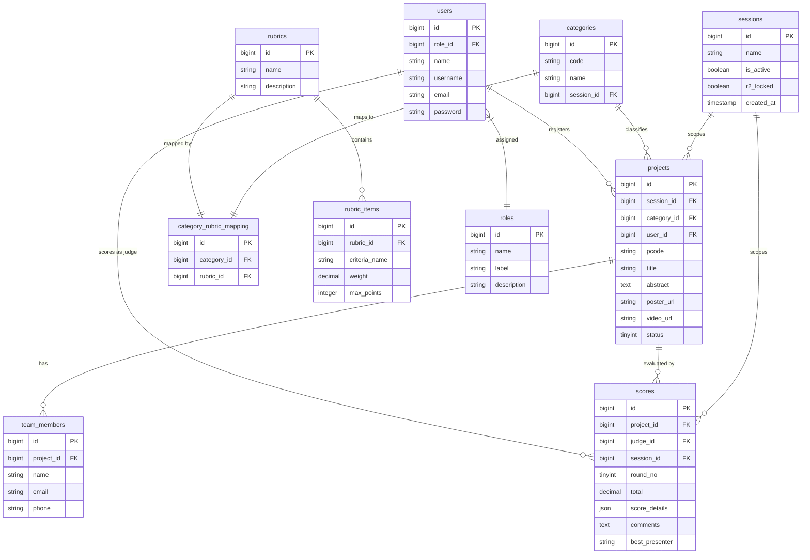

# Database Architecture Reference: INOTEK

This document outlines the database design, Entity Relationship Diagram (ERD), schema definitions, and constraints for the INOTEK system.

---

## 1. Entity Relationship Diagram (ERD)

---

## 2. Table Specifications

### 2.1 Table: `sessions`
Defines competition semesters or sessions.
| Column | Type | Nullable | Constraints & Description |
| :--- | :--- | :--- | :--- |
| `id` | BigInt | No | Primary Key, Auto-increment. |
| `name` | Varchar(255) | No | Session display name (e.g. "Semester 1 2026/2027"). |
| `is_active` | Boolean | No | Default: `false`. Scopes active operations. |
| `r2_locked` | Boolean | No | Default: `false`. Locks Round 2 scores. |
| `created_at` / `updated_at` | Timestamp | Yes | Standard record timestamps. |

### 2.2 Table: `categories`
Managed dynamic categories per session.
| Column | Type | Nullable | Constraints & Description |
| :--- | :--- | :--- | :--- |
| `id` | BigInt | No | Primary Key, Auto-increment. |
| `code` | Varchar(50) | No | e.g. "C1", "C2" |
| `name` | Varchar(255) | No | e.g. "Emerging Technology" |
| `session_id` | BigInt | Yes | Foreign Key referencing `sessions.id`. |
| `allow_team` | Boolean | No | Default: `false`. True if team registrations are allowed (group projects). |

### 2.3 Table: `roles`
System authorization access keys.
| Column | Type | Nullable | Constraints & Description |
| :--- | :--- | :--- | :--- |
| `id` | BigInt | No | Primary Key. |
| `name` | Varchar(100) | No | Unique technical identifier key (e.g. `admin`, `lecturer`, `judge`, `user`). |
| `label` | Varchar(100) | No | Display name (e.g. `Lecturer`). |
| `description` | Varchar(255) | Yes | Role capabilities overview. |

### 2.4 Table: `users`
Accounts list.
| Column | Type | Nullable | Constraints & Description |
| :--- | :--- | :--- | :--- |
| `id` | BigInt | No | Primary Key, Auto-increment. |
| `role_id` | BigInt | Yes | Foreign Key referencing `roles.id`. Set to Null on Role delete. |
| `name` | Varchar(255) | No | Full name. |
| `username` | Varchar(255) | No | Unique username identifier. |
| `email` | Varchar(255) | No | Unique email address. |
| `password` | Varchar(255) | No | Hashed password string. |
| `remember_token` | Varchar(100) | Yes | Session persistent token. |

### 2.5 Table: `projects`
Project details submitted by participants.
| Column | Type | Nullable | Constraints & Description |
| :--- | :--- | :--- | :--- |
| `id` | BigInt | No | Primary Key, Auto-increment. |
| `session_id` | BigInt | No | Foreign Key referencing `competition_sessions.id`. |
| `category_id` | BigInt | No | Foreign Key referencing `categories.id`. |
| `user_id` | BigInt | No | Foreign Key referencing `users.id`. |
| `pcode` | Varchar(100) | Yes | Unique project code within the session (auto-generated or overridden). |
| `title` | Varchar(255) | No | Project title. |
| `abstract` | Text | No | Project abstract details. |
| `poster_url` | Varchar(255) | Yes | File upload path to the project poster. |
| `video_url` | Varchar(255) | Yes | Path to the demonstration video. |
| `institution_type`| Varchar(50) | No | Institution origin: `utem` or `ipt`. |
| `status` | TinyInt | No | Default: `1` (STATUS_NEW). Progress states 1-6. |
| `supervisor_name` | Varchar(255) | No | Name of project supervisor. |
| `supervisor_email`| Varchar(255) | No | Email of project supervisor. |
| `supervisor_phone`| Varchar(100) | Yes | Phone number of project supervisor. |
| `admin_comments` | Text | Yes | Review feedback remarks from administrator. |
| `deleted_at` | Timestamp | Yes | Soft delete support. |

> [!NOTE]
> **Unique Constraint**: The combination of `[session_id, pcode]` must be unique.

### 2.6 Table: `team_members`
Dynamic team list associated with projects.
| Column | Type | Nullable | Constraints & Description |
| :--- | :--- | :--- | :--- |
| `id` | BigInt | No | Primary Key, Auto-increment. |
| `project_id` | BigInt | No | Foreign Key referencing `projects.id`. Deleted cascade-on-delete. |
| `name` | Varchar(255) | No | Team member full name. |
| `email` | Varchar(255) | Yes | Contact email. |
| `phone` | Varchar(100) | Yes | Contact phone number. |
| `deleted_at` | Timestamp | Yes | Soft delete support. |

### 2.7 Table: `scores`
Judges evaluation marks.
| Column | Type | Nullable | Constraints & Description |
| :--- | :--- | :--- | :--- |
| `id` | BigInt | No | Primary Key, Auto-increment. |
| `project_id` | BigInt | No | Foreign Key referencing `pendaftaran.id`. |
| `judge_id` | BigInt | No | Foreign Key referencing `users.id`. |
| `session_id` | BigInt | No | Foreign Key referencing `sessions.id`. |
| `round_no` | TinyInt | No | Default: `1`. Pusingan 1 or 2 evaluation. |
| `total` | Decimal(5,2) | No | Aggregate calculated grade (0-100). |
| `score_details` | Json | No | Key-value breakdown of rubric items. |
| `comments` | Text | Yes | Judge's textual feedback. |
| `best_presenter`| Varchar(100) | Yes | Best presenter vote. |

> [!IMPORTANT]
> **Unique Composite Key**: To support session reuse and dual rounds, a unique constraint is enforced on `[project_id, judge_id, session_id, round_no]`.

### 2.8 Table: `rubrics`
Rubrics catalog.
| Column | Type | Nullable | Constraints & Description |
| :--- | :--- | :--- | :--- |
| `id` | BigInt | No | Primary Key, Auto-increment. |
| `name` | Varchar(255) | No | e.g. "Standard Engineering Rubric" |
| `description` | Text | Yes | Rubric scope description. |

### 2.9 Table: `rubric_items`
Individual criteria within rubrics.
| Column | Type | Nullable | Constraints & Description |
| :--- | :--- | :--- | :--- |
| `id` | BigInt | No | Primary Key, Auto-increment. |
| `rubric_id` | BigInt | No | Foreign Key referencing `rubrics.id`. Cascade-on-delete. |
| `criteria_name` | Varchar(255) | No | Criteria heading (e.g. "Novelty"). |
| `weight` | Decimal(4,2) | No | Rubric item weight multiplier (e.g. `0.20` for 20%). |
| `max_points` | Integer | No | Default: `5`. Maximum scale points. |

### 2.10 Table: `category_rubric_mapping`
Maps category entries to distinct evaluation rubrics.
| Column | Type | Nullable | Constraints & Description |
| :--- | :--- | :--- | :--- |
| `id` | BigInt | No | Primary Key, Auto-increment. |
| `category_id` | BigInt | No | Foreign Key referencing `categories.id`. Cascade-on-delete. |
| `rubric_id` | BigInt | No | Foreign Key referencing `rubrics.id`. Cascade-on-delete. |
