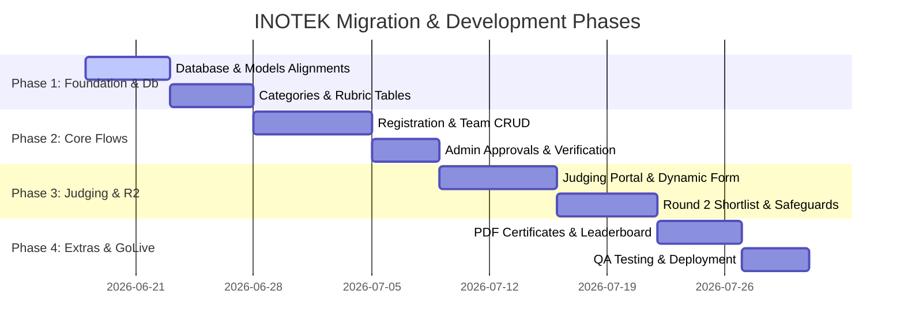

# INOTEK Development Roadmap (TODOS)

This document outlines the roadmap, plans, and checklist for developing the new INOTEK system based on the legacy PHP application, gap requirements, and system refinements.

---

## 📋 Task Checklist

### 1. Database & Model Alignment (Session & Semester Isolation)
Judging runs twice a year (semesters). The same project IDs and judges can reappear in different sessions.
- [x] Configure `Project` model status constants:
  - `1` = `STATUS_NEW`
  - `2` = `STATUS_EDIT`
  - `3` = `STATUS_SUBMITTED`
  - `4` = `STATUS_APPROVED`
  - `6` = `STATUS_CANCELLED`
- [x] Ensure all operations on projects (`pendaftaran` table) and evaluations (`scores` table) are strictly scoped by `session_id`.
- [x] Create migration to add `round_no` (TINYINT, default 1) to the `scores` table.
- [x] Create migration to add `r2_locked` (BOOLEAN, default false) to the `competition_sessions` table.
- [x] Set up composite unique key index: `[project_id, judge_id, session_id, round_no]` to allow the same judge to evaluate the same project ID across different semesters or rounds without database conflict.

### 2. Dynamic Categories Management
Categories must be fully dynamic (not hardcoded) to support changes from semester to semester.
- [x] Create `categories` database table (replacing static C1-C6 codes):
  - `id` (primary key)
  - `code` (e.g., `C1`)
  - `name` (e.g., `Green Technology`)
  - `session_id` (nullable, if categories are scoped per semester)
- [x] Link `Project` model to `Category` model via `category_id` (foreign key).
- [x] Build Admin Panel UI to CRUD categories (Add, edit, remove).

### 3. Category-Rubric Mapping
Pemarkahan (Scoring) must pull dynamic rubric criteria based on the selected project category.
- [x] Create database tables:
  - `rubrics` (id, name, description)
  - `rubric_items` (id, rubric_id, criteria_name, weight, max_points)
  - `category_rubric_mapping` (id, category_id, rubric_id)
- [x] Build Admin Panel to assign rubrics to categories.
- [x] Build dynamic evaluation form rendering in the Judge Portal (looks up project's category -> looks up rubric -> renders inputs dynamically).
- [x] Store breakdown scores as a JSON array (`score_details`) in the `scores` table, and final calculated value in `total`.

### 4. Round 2 (Pusingan Ke-2) Pemarkahan
Select Top 3 or Top 5 projects per category for a second evaluation round, ensuring no judge conflict.
- [x] Develop query logic in `ScoreCalculator` to average Round 1 scores:
  - Select Top N projects (where N is configurable: 3 or 5) grouped by `category_id`.
- [x] Build Admin UI to view the qualified Round 2 shortlist and assign Round 2 judges.
- [x] Implement validation rule: Block assignment if the judge already evaluated the same project in Round 1.
- [x] Implement Round 2 locking (`r2_locked` inside the active session).

### 5. Project Registration & Team Management
- [x] Design the dynamic team member registration form in React.
- [x] Set up the `TeamMember` model and associate it with the `Project` model (One-to-Many relationship mapping to the `penyelidik` database table).
- [x] Build the file upload logic for poster and video links.

### 6. Admin Approvals & Project Verification
- [x] Implement bulk project approvals (`approve_projects`) interface for admins.
- [x] Add administrative review comments and flags for rejected or pending projects.

### 7. Certificate Generation
- [x] Configure **DomPDF** template wrappers in the backend.
- [x] Build user-facing download routes for "Participation" and "Achievement" certificates.

### 8. Real-Time Leaderboard & Audit Log
- [ ] Set up **Laravel Reverb** (WebSocket) to stream live score changes to the public leaderboard.
- [x] Set up automatic event listeners to log critical admin actions (resets, status changes, rubric edits) to the `audit_logs` table.

---

## 🛠️ Implementation Phases

### Phase 1: Foundation & Db (10 Days)
Align models, setup dynamic categories and category-rubric mapping tables, and seed roles.

### Phase 2: Core Flows (11 Days)
Build the registration form and bulk project approval/verification UI.

### Phase 3: Judging & Round 2 (13 Days)
Develop the dynamic rubric scoring, the judge scoring dashboard, and the Round 2 qualification process.

### Phase 4: Extras & Go-Live (9 Days)
Add DomPDF certificate exports, real-time leaderboard broadcasts, comprehensive feature tests, and deploy the system.

---

## 🚀 Advanced Polish & Recommendations (Value-Add Features)

These are recommended high-premium enhancements to improve user engagement, system reliability, and institutional security:

### 1. Dynamic Certificate Verification (Secure QR Code Verification)
- [x] Add a unique, secure QR code at the bottom of generated PDF certificates (DomPDF).
- [x] Implement a public verification route: `/verify/certificate/{hash}`.
- [x] Scan verification: Allows external parties (employers, sponsors) to scan the certificate QR and instantly verify the student's name, project title, category, score, and achievement level on the system's official portal.

### 2. Gamified Judge Progress Dashboard
- [x] Build a visual progress tracker for judges showing:
  - "Total Assigned Projects" vs. "Completed Appraisals".
  - A clean visual progress bar to motivate judges.
  - Alert indicators for projects pending scoring.

### 3. Real-Time Admin Judging Monitor (Visual Chart)
- [x] Add a real-time completion chart in the Admin Dashboard showing progress per category (e.g., Green Tech: 90% judged, emerging tech: 40% judged).
- [x] Implement a single-click "Nudge Pending Judges" button to send automated friendly email reminders to judges who haven't completed their scoring.

### 4. Database Integrity & Soft Deletes
- [x] Implement Laravel's `SoftDeletes` trait on the `Project`, `TeamMember`, and `User` models.
- [x] Prevent data loss: If a user or project is deleted accidentally, admins can restore it from the backend instead of corrupting historical evaluation records.

### 5. Admin Audit Log Viewer
- [x] Create a read-only logging dashboard at `/admin/audit-logs` mapping system actions.
- [x] Filter actions (e.g., "Reset Data", "Category Added", "Project Approved") showing timestamp, IP address, and the user who executed the action.
